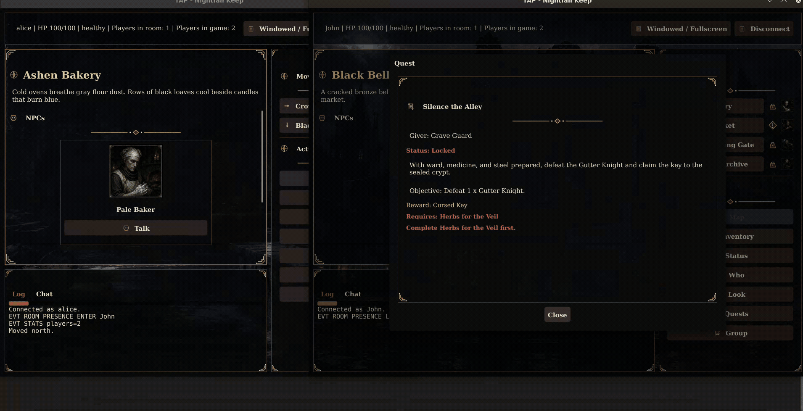
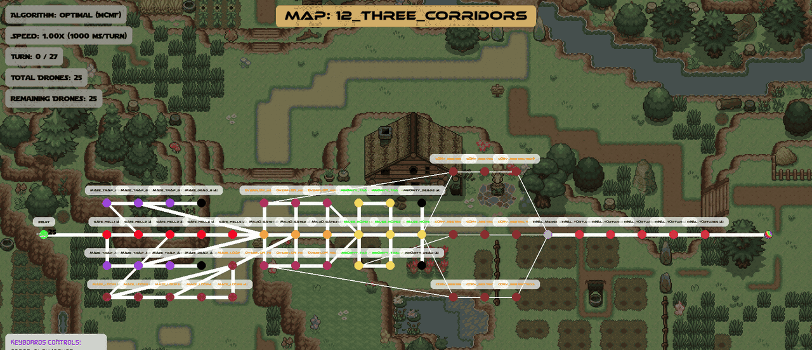
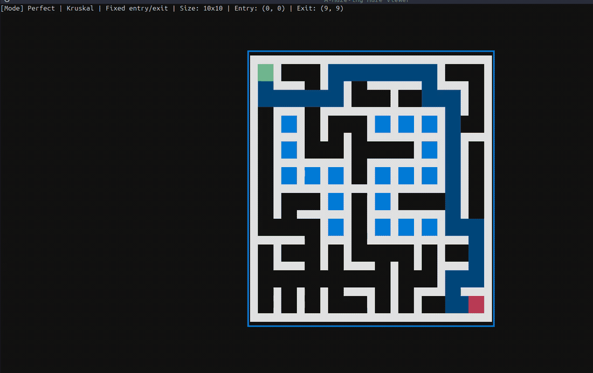
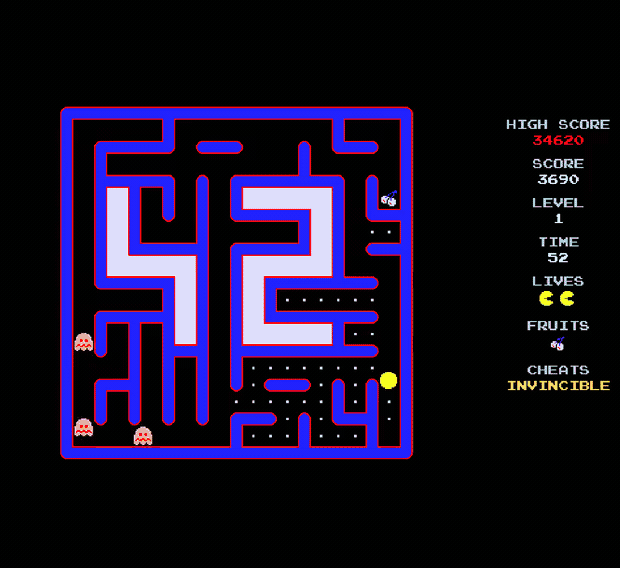
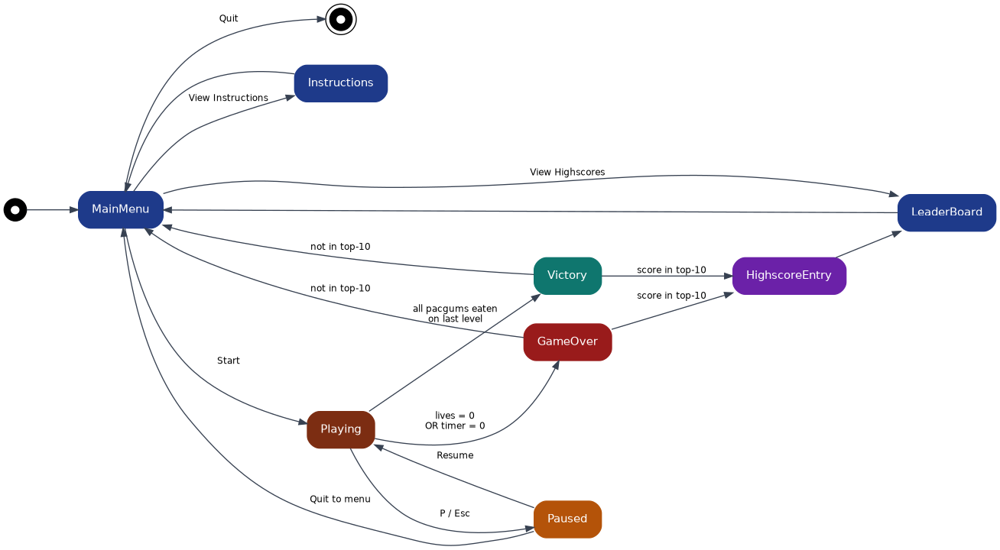
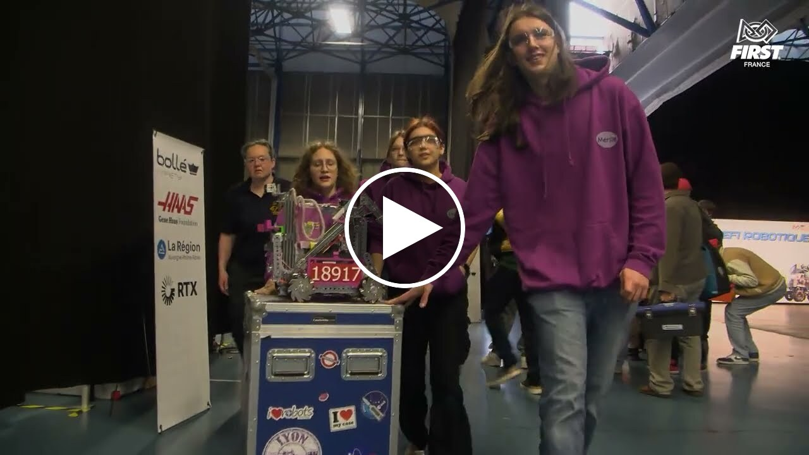

# Portfolio — Jérôme Barthélemy

Neuf de mes projets, huit réalisés à 42 et un au sein de mon club de robotique.

Ce dépôt explique ce qui a été construit, pourquoi, et ce que j'en ai retiré.

---

## TAP, un serveur de jeu multijoueur TCP
**Go · en binôme · juin 2026 · [code public](https://github.com/JeromeBarthelemy/tap-server)** · 118 commits sur 145

**Le problème :**
Faire exister plusieurs joueurs dans un même monde partagé, en implémentant un
protocole assez précisément spécifié pour qu'un autre client développé séparément selon le même protocole puisse se
connecter à notre serveur sans une ligne de code en commun.

*Deux clients connectés au même serveur : ce que fait un joueur parvient à l'autre sous
forme d'événement poussé par le serveur, seul détenteur de l'état du monde.*

**Ce que nous avons construit :**
Le protocole RFC étant fourni, nous avons construit un serveur TCP et deux clients, l'un graphique
et l'autre en ligne de commande. Le serveur possède l'état du monde ; les clients ne font que l'observer. Les événements (un joueur entre
dans la salle, un combat commence, ...) sont traités de façon asynchrone.

**Ce qui a compté :**
- Choisir l'architecture de nos goroutines pour éviter les data race
- `go test -race` sur toute la suite
- Journalisation JSON structurée (`log/slog`) et détection d'abus

---

## Agent Smith, un harnais d'agent LLM
**Python · à trois · août 2026 · [code public](https://github.com/Enelsep/agent-smith)** · 224 commits sur 282

**Le problème :**
Faire résoudre à un modèle de langage de vraies tâches de programmation,
comme écrire une fonction (MBPP) ou corriger un bug dans un vrai dépôt (SWE-bench), sans
plantage, ni dépassement de budget (tokens en entrée et en sortie, nombre d'itérations et temps).

**Ce que nous avons construit :**
Une boucle Pensée → Code → Observation. Le modèle
n'émet pas d'appel d'outil JSON : il écrit un bloc de code Python, exécuté dans un
interpréteur restreint (sandbox sécurisée) où les outils MCP sont de simples fonctions.
La sortie de la sandbox est ensuite renvoyée au modèle après mise en forme pour la rendre la plus lisible possible.
L'itération se poursuit jusqu'à obtenir une solution ou épuisement du budget.

**Ce qui a compté :**
- **Un plantage vaut zéro**, donc rien ne remonte d'exception : chaque chemin d'échec renvoie un résultat valide avec son erreur renseignée.
- **Chaque plafond est dur** : itérations, tokens en entrée et en sortie, temps réel. La boucle réserve de quoi tenter une dernière soumission plutôt que de mourir en pleine réflexion.
- Agnostique du fournisseur : un endpoint OpenAI-compatible absent de la config ne demande aucune modification de code, seulement une URL.

**Ce que nous avons mesuré :**
- Sur **MBPP** : **233 tâches réussies sur 257** avec `mistral-medium-latest` (notre meilleur modèle gratuit), contre
205 sur 257 avec `codestral-2508` par exemple. Le harnais est le même, seul le modèle change. Pour la plupart des tâches réussies, nous restons bien en dessous des plafonds (**2 à 3 itérations sur
les 10 autorisées** et **quelques secondes sur les 120 autorisées**).
- Sur **SWE-bench** : 3 des modèles gratuits parviennent à faire un score de 7/7 sur les 7 tâches choisies, là encore en restant le plus souvent très en deçà des plafonds autorisés.

---

## Call Me Maybe, un appel de fonctions par un petit modèle local
**Python · en solo · avril 2026 · [code public](https://github.com/JeromeBarthelemy/CallMeMaybe)**

**Le problème :**
Traduire une requête en langage naturel, comme par exemple « Quelle est la somme de 2 et
3 ? », non pas en réponse, mais en **appel de fonction structuré** : le nom de la fonction
à invoquer et ses arguments typés, le tout en format JSON valide. Le modèle imposé est Qwen3-0.6B, un modèle de
600 millions de paramètres tournant en local.

**La difficulté :**
Un modèle de cette taille ne produit du JSON valide qu'environ une fois
sur trois quand on se contente de le lui demander. Le prompt ne suffit pas : il faut
contraindre la génération.

**Ce que j'ai construit :**
Un décodage sous contrainte, qui guide le modèle jeton par jeton
pour garantir à chaque étape une sortie structurellement **et** sémantiquement valide : le
nom de fonction ne peut être qu'un nom existant, un argument numérique ne peut être qu'un
nombre. La fiabilité passe ainsi d'environ 30 % à la quasi-perfection.

**Ce qui a compté :**
- **Contraindre plutôt que demander.** Espérer d'un modèle qu'il respecte un format est une stratégie ; l'empêcher de produire autre chose en est une autre. Seule la seconde donne des garanties.
- Un modèle de 0,6 milliard de paramètres tournant sur CPU rend le problème intéressant : sans marge de manœuvre, la structure doit venir du code, pas de la puissance du modèle.
- C'est la même philosophie que dans Agent Smith : plutôt que de faire confiance à la sortie du modèle, on le contraint et on le vérifie.

**Ce que j'ai mesuré :**
**100 % de JSON analysable** — le décodage sous contrainte le garantit par
construction, contre environ 30 % en sollicitant naïvement le modèle. **Plus de 90 % de
sélections de fonction et d'extractions d'arguments correctes.** L'ensemble des prompts est
traité en moins de cinq minutes sur une machine ordinaire.

---

## RAG against the machine, la recherche augmentée
**Python · en solo · juin 2026 · [code public](https://github.com/JeromeBarthelemy/RAG)**

**Le problème :**
Répondre à des questions sur la base de code vLLM 0.10.1 en citant
ses sources, avec un modèle assez petit pour tourner sur CPU.

**Ce que j'ai construit :**
Un pipeline en quatre étapes derrière une seule CLI : ingestion, recherche,
réponse, évaluation. Le corpus est découpé, indexé, puis
interrogé ; le modèle Qwen3-0.6B rédige ensuite la réponse à partir des seuls extraits retrouvés.

**Ce qui a compté :**
- La qualité de la recherche est une métrique, pas une impression : *recall@k* contre un jeu de référence, mesuré à chaque changement de stratégie de découpage.
- Séparer récupération et génération : quand la réponse est fausse, on sait laquelle des deux moitiés a échoué.
- 43 tests unitaires et mypy en mode strict.

**Ce que j'ai mesuré :**
Pour la recherche lexicale BM25 sur environ 14 000 fragments, deux décisions ont été adoptées, chacune
validée par la mesure :
- découper les noms de fichiers, de classes et de fonctions, ainsi `fused_batched_moe` devient `fused batched moe`,
fait passer le **recall@5 du code de 55 % à 65 %**.
- router chaque question vers un index dédié au code ou à la documentation plutôt qu'un index unique fait passer celui de la documentation **de 83 % à 91 %**.

---

## Inception, une infrastructure conteneurisée
**Docker · en solo · juillet 2026 · [code public](https://github.com/JeromeBarthelemy/Inception)**

**Le problème :**
Monter une infrastructure web complète sans tirer une seule image
toute faite du Docker Hub : chaque conteneur est construit à la main, un service par conteneur.

**Ce que j'ai construit :**
WordPress avec php-fpm et MariaDB derrière un NGINX qui est
le seul point d'entrée, en TLS 1.2 et 1.3 uniquement. Puis cinq services en bonus :
cache objet Redis, client de base Adminer, monitoring Netdata, serveur FTP, site
statique de documentation. Huit images, toutes depuis `alpine`, jamais le tag `latest`.

**Ce qui a compté :**
- Les données survivent au conteneur : volumes nommés pour la base et les fichiers du site.
- Un seul port ouvert vers l'extérieur en dehors du FTP, qui n'est pas de l'HTTP et ne peut donc pas passer par le proxy.

---

## Fly-in, un routage de flotte sur graphe contraint
**Python · en solo · avril 2026 · [code public](https://github.com/JeromeBarthelemy/Fly-in)**

*25 drones sur une carte de 52 zones : la flotte se répartit sur trois corridors à
capacité restreinte, les emprunte en parallèle du tour 9 au tour 20, puis se regroupe
dans le goulet final. Résolu en 27 tours.*

**Le problème :**
Amener une flotte de drones d'une zone de départ à une zone d'arrivée
**en un minimum de tours**, sur un graphe où chaque zone a une capacité, chaque liaison
un débit, et où certaines zones coûtent deux tours à traverser ou sont interdites.

**Ce que j'ai construit :**
Un flot de coût minimal sur un **graphe étendu dans le
temps** : chaque zone est dédoublée en entrée et sortie, à chaque tour, et l'horizon
s'allonge d'une couche tant que la flotte n'est pas écoulée. Les types de zone deviennent
des coûts d'arête, les capacités des bornes de flot. Un visualiseur rejoue la simulation
au tour par tour ou en version animée (pygame), avec zoom et navigation avant/arrière.

**Ce qui a compté :**
- Trouver le plus court chemin est facile (Dijkstra) et envoyer tous les drones en file indienne sur ce chemin unique s'avère suffisant sur les maps fournies par le sujet. J'ai donc soit modifié les maps existantes, soit récupéré des maps personnalisées faites par d'autres pour vérifier que mon algorithme mettait en œuvre un **véritable parallélisme du flux** quand c'était pertinent.
- L'algorithme étant intrinsèquement du tour par tour, l'**interpolation de la position des drones entre deux zones** pour en faire une animation fluide et navigable dans les deux sens n'a pas été simple.

---

## A-Maze-ing, génération de labyrinthes et rendu dans le terminal
**Python · Textual · en binôme · mars 2026 · [code public](https://github.com/JeromeBarthelemy/A-Maze-ing)** · 73 commits sur 78

*Le visualiseur Textual : régénération, affichage du chemin le plus court, taille du
labyrinthe et thème changés à la volée — et le motif `42` réservé au centre dès que la
place le permet.*

**Le problème :**
Générer un labyrinthe valide à partir d'un fichier de configuration,
l'exporter dans un format hexadécimal imposé, et le rendre lisible. « Valide » signifie par exemple qu'en mode parfait, il doit exister exactement un chemin entre l'entrée et
la sortie, et le motif `42` réservé au centre ne doit ni couper le graphe, ni créer de
cycle.

**Ce que nous avons construit :**
Deux algorithmes de génération interchangeables au-dessus d'une
même structure de grille : parcours en profondeur avec retour arrière, et Kruskal sur les arêtes.
Un solveur de plus court chemin, un validateur de sortie qui
relit le fichier produit, et deux moteurs de rendu : une interface Textual et un
visualiseur ASCII de repli pour les terminaux sans couleur.

**Ce qui a compté :**
- **L'algorithme Kruskal** permet de générer facilement des labyrinthes parfaits, sans aucun biais, avec d'excellentes performances grâce à l'Union-Find et sans risque de heurter la limite de récursivité.
- **Le validateur lit le fichier, pas la mémoire.** Il re-parse la sortie hexadécimale et vérifie la connexité dessus. Deux bugs d'export sont tombés là, invisibles depuis les structures internes.
- **Le générateur est un paquet, pas un script.** `mazegen` est packagé et versionné ; deux mois plus tard il est devenu la dépendance qui fournit les labyrinthes de mon Pac-Man, sans une ligne modifiée.

---

## Pac-Man, une machine à états en retrogaming
**Python · Pygame · en binôme · mai 2026** · 54 commits sur 91

*Niveaux 1, 2 et 3 : le labyrinthe n'est pas dessiné à la main. Il est généré à chaque
niveau par `mazegen` avec le motif `42` réservé
au centre.*

**Le problème :**
Plus qu'un problème d'affichage, un jeu d'arcade est un
problème d'états. Menu, partie en cours, pause, mort, victoire, saisie du meilleur score,
tableau des scores — chacun avec ses transitions, ses conditions de sortie, et ce qu'il
faut préserver en passant de l'un à l'autre.

**Ce que nous avons construit :**
Une machine à états explicite, portée par `App`.
`GameEngine` n'existe que pendant l'état `PLAYING` et émet à chaque image des événements
de transition qu'`App` consomme. Le labyrinthe est fourni par `mazegen`, le paquet issu de mon projet A-Maze-ing,
installé comme dépendance locale. Les animations des menus sont «faites à la main». De nombreux «cheat codes» sont disponibles (invincibilité, vitesse, passage à travers les murs, ...).

**Ce qui a compté :**
- **Le schéma ci-dessus est généré, pas dessiné.** Il vient de sources Graphviz versionnées à côté du code, ce qui permet que quand la machine à états change, le schéma suit.
- **Une branche par auteur, des pull requests entre nous et un Kanban sur Linear pour le suivi de projet.** Chaque intégration est passée par une revue, le dépôt conserve les tickets, les revues et le tableau Kanban.
- **Séparer les états du moteur a payé tard.** Ajouter la pause, la saisie de score et le tableau des scores n'a demandé aucune modification du moteur de jeu — seulement de nouveaux états et de nouvelles transitions.

*Code disponible sur demande car le dépôt contient des ressources graphiques et sonores issues
du jeu d'arcade original, qui ne m'appartiennent pas. Le jeu peut aussi être testé sous la forme d'un package exécutable autonome.*

---

## BaguetTechs, le code de notre robot FTC, saison DECODE
**Java · équipe FIRST Tech Challenge 20989 · octobre 2025 – juin 2026 · [dépôt public](https://gitlab.com/ftc-civ/baguettechs/ftc-decode-2026)** · 68 commits sur 108

*▶ **Vidéo** — la finale du championnat de France 2025, sur la chaîne officielle Robotique
FIRST France. [Regarder sur YouTube](https://youtu.be/-FN2Mel6wsQ).*

**Le problème :**
Un robot de compétition FTC dispose de deux minutes trente par match,
dont trente secondes entièrement autonomes. Il doit se déplacer avec précision sur un
terrain qu'il ne voit qu'à travers ses capteurs, et exécuter des actions de jeu avec précision (lancer de balles par exemple).

**Ce que nous avons construit :**
Le pilotage d'un châssis mecanum, en modes robot-centric et field-centric,
l'orientation par centrale inertielle, la correction de cap, le réglage PID moteur par
moteur, le contrôle du lanceur, et l'asservissement de sa vitesse de tir par la caméra
Limelight.

**Ce qui a compté :**
- **Le matériel ne se comporte jamais comme le modèle.** Un moteur ne tourne pas à la vitesse demandée, une centrale inertielle dérive, un servo ne revient pas exactement en position. La moitié du travail consiste à laisser des constantes réglables plutôt qu'à écrire du code plus élégant.
- **Le PID individuel par moteur a fini désactivé** : les quatre boucles se battaient entre elles et dégradaient la trajectoire. Un asservissement global de cap, plus simple, s'est révélé plus stable — la solution correcte n'était pas la plus sophistiquée. C'est une situation qui revient souvent en robotique.
- **Le code est lu et écrit par des lycéens.** Il doit rester compréhensible par quelqu'un qui apprend Java depuis six mois.

### Palmarès du club Robotique CIV

Club co-fondé en 2019 et constitué en association en 2020. Aujourd'hui 60 lycéens en quatre équipes, encadrés
par une dizaine de mentors adultes — professeurs et ingénieurs de nos entreprises partenaires — engagés au
Royaume-Uni, en France, aux Pays-Bas, au Canada et aux États-Unis, sur un budget de fonctionnement d'environ
40 000 € par an. Résultats vérifiables sur les pages officielles *FIRST*.

| Équipe | Résultats principaux |
|---|---|
| [BaguetTechs — FTC 20989](https://ftc-events.firstinspires.org/team/20989) | **Champion de France 2025** (capitaine de l'alliance gagnante, invaincue en saison régulière) · Finaliste France 2026 + Think Award · Inspire Award Londres 2022 · European Premier Event, Eindhoven |
| [FRITES — FTC 20991](https://ftc-events.firstinspires.org/team/20991) | **Champion de France 2026** (alliance gagnante) + Control Award · Finaliste Valence 2026 + Innovate Award · Vainqueur Londres 2022 |
| [TheFrenchineers — FTC 20990](https://ftc-events.firstinspires.org/team/20990) | **Inspire Award (la plus haute distinction du FIRST Tech Challenge), championnat de France 2026** · Alliance gagnante France 2025 |
| [Geekos — FRC 9220](https://frc-events.firstinspires.org/team/9220) | Finaliste régional 2026 + Gracious Professionalism Award · Rising All-Star Award, **New York City Regional 2025** · Imagery Award, **Long Island Regional 2024** |

Le championnat de France FTC n'existe que depuis 2025. Comme les matchs se jouent en 2vs2, il y a deux champions de France par an, soit quatre en tout pour le moment dont 3 sont nos 3 équipes de FTC (le club a remporté les deux
éditions, avec 2 de nos équipes dans la même alliance en 2025).

---

📫 **jerbarth@gmail.com** · [LinkedIn](https://www.linkedin.com/in/jerome-barthelemy/)
